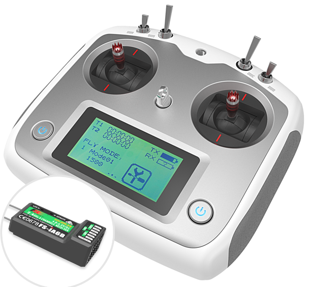

    
 
  

### Explanation of the Code

The provided code is a comprehensive control program for a Teensy 4.1-based drone. It integrates various sensors and modules, including a GPS sensor, gyroscope, accelerometer, barometer, magnetometer, and battery monitoring. The code also handles communication with an RC receiver and a Bluetooth module for telemetry.

#### Key Components and Functions:

1. **Global Variables and Pin Definitions:**
   - The code defines pins for various components such as motors, LEDs, battery voltage, and current measurement.
   - Global variables are declared for sensor readings, PID control, and battery status.

2. **Setup Function:**
   - Initializes serial communication for debugging and Bluetooth.
   - Initializes I2C communication for sensors.
   - Initializes the gyroscope, accelerometer, barometer, and magnetometer.
   - Calibrates the gyroscope and accelerometer.
   - Sets up PWM frequencies for motor control.
   - Detects the battery type and initializes the starting battery energy.
   - Initializes the RC receiver.
   - Sets up the GPS module and checks its connection.

3. **Loop Function:**
   - The main loop is divided into several timed sections using `micros()` to ensure periodic execution of different tasks.
   - **Sensor Reading (every 4ms):**
     - Reads data from the gyroscope, accelerometer, and magnetometer.
     - Performs sensor fusion using a complementary filter to combine gyroscope and accelerometer data.
     - Integrates acceleration to get velocity and position.
   - **Barometer Reading (every 100ms):**
     - Reads data from the barometer and calculates relative altitude.
   - **Receiver Data Reading:**
     - Reads data from the RC receiver (either IBUS or PPM) to get control inputs.
   - **PID Control (every 4ms):**
     - Calculates desired angles or rates based on receiver inputs.
     - Applies PID control to calculate motor inputs.
     - Compensates throttle based on pitch angle to avoid altitude drop.
     - Sends motor inputs to the ESCs.
   - **Battery Check:**
     - Monitors battery voltage and current.
     - Estimates remaining battery capacity and controls an LED based on battery level.
   - **Debugging and Telemetry (every 100ms):**
     - Prints debug information to the serial monitor.
     - Sends telemetry data to the Bluetooth module.
   - **LED Flashing (every 400ms):**
     - Toggles the built-in LED to indicate the program is running.

#### Functions:

- **readGPSData():** Reads and validates GPS data, updating global variables.
- **battery_voltage():** Reads and smooths battery voltage and current.
- **detect_battery_type():** Detects the battery type based on voltage.
- **estimate_capacity_from_voltage():** Estimates battery capacity based on voltage.
- **battery_check():** Monitors battery status and updates energy consumption.
- **read_receiver():** Reads data from the RC receiver.
- **checkGPSConnection():** Checks if the GPS module is connected.
- **clamp():** Clamps a value within a specified range.
- **pid_equation():** Calculates PID output based on error terms.
- **determine3SwitchState():** Determines the state of a 3-position switch based on receiver input.
- **reset_pid():** Resets PID-related variables.
- **serial_print_bluetooth_app():** Sends telemetry data to the Bluetooth module.
- **serial_print_debug():** Prints debug information to the serial monitor.

#### Summary:
The code is designed to control a drone using various sensors and modules. It reads sensor data, performs sensor fusion, applies PID control, and sends motor commands to maintain stable flight. It also monitors battery status and provides telemetry data via Bluetooth. The code is structured to ensure periodic execution of different tasks, making it suitable for real-time control applications.

## Main dronecode Teensy4.1 board and Flysky IA6B reciever
- [Drone_IBus_PPM_Gyro_Acc_Baro_GPS_PID_regeling](src/main.cpp)  
  classes:
  - [IBusReceiver](src/IBusReceiver.h)  
  - [GyroSignals](src/GyroSignals.h)  
  - [Barometer](src/Barometer.h)  

## Explore code by seperate subjects
- Read IBUS receiver by decoding PPM and writes values to PWM outputs   
- Read IBUS receiver by decoding IBUS  
- Read GPS sensor GY_GPSV3_NEO_M9N  
- Read GYRO ACCELERATION sensor MPU6050 and use sensor fusion with complementary filtering  
- Read barometer sensor BMP280  

## Flysky sender reciever
> [FlySky website FS-i6S sender](https://www.flysky-cn.com/fsi6s)  
> [Flysky IA6B receiver 6 channels (pwm) 8 channels (ppm) 10 channels (IBus)](https://www.flysky-cn.com/ia6b-canshu)  
> [Flysky Ix6B receiver 6 channels (pwm) 8 channels (ppm) 10 channels (IBus)](https://www.flysky-cn.com/x6b-canshu)

  
  
### Flysky reciever IBUS protocol servo and sensor data
> [IBUS explained Betaflight](https://betaflight.com/docs/wiki/guides/current/ibus-telemetry)  
> [IBUS github](https://github.com/bmellink/IBusBM)

## Drone control diagram

## Microcontrollerboard Teensy (4.1)
> [Teensy doc](https://www.pjrc.com/teensy/index.html)  
> [USB power and external power doc](https://www.pjrc.com/teensy/external_power.html)  
> [pins teensy board doc](https://www.pjrc.com/store/teensy41.html#pins)  
> [Pinout referencecard front](https://www.pjrc.com/teensy/card11a_rev4_web.pdf)  
> [Pinout referencecard back](https://www.pjrc.com/teensy/card11b_rev4_web.pdf)  
> [Teensy 4.1 technical doc](https://www.pjrc.com/store/teensy41.html)  

## Sensor fusion accelerometers and gyroscopes
> [Sensor fusion explained](https://www.digikey.nl/nl/articles/apply-sensor-fusion-to-accelerometers-and-gyroscopes)  

## IMU (Inertial Measurement Unit) depth  
> Hrisko, J. (2021). Gyroscope and Accelerometer Calibration with Raspberry Pi. Maker Portal.  
> https://makersportal.com/blog/calibration-of-an-inertial-measurement-unit-imu-with-raspberry-pi-part-ii  
> [Gyro Acc sensor MPU-6050 register mapping](https://invensense.tdk.com/wp-content/uploads/2015/02/MPU-6000-Register-Map1.pdf)  
> [Gyro Acc sensor MPU-6050 datasheet](https://invensense.tdk.com/wp-content/uploads/2015/02/MPU-6000-Datasheet1.pdf)  

## GPS Sensor GNSS data
> [GPS sensor data](https://mediatum.ub.tum.de/doc/1273200/1273200.pdf)  
> [GPS + magneto sensor Mateksys M10q-5883](https://www.mateksys.com/?portfolio=m10q-5883)  

## drone parts documentation
> [Motor Brushless Emax RSIII 2306 2500kV](https://emaxmodel.com/collections/rsiii-series/products/copy-of-pre-order-emax-rsiii-2207-fpv-racing-motor?variant=43833290424578)  
> [ESC T-motor F45A-32bit 3-6S](https://uav-en.tmotor.com/html/2018/esc_0712/173.html)  
> [Opensource controller software BL_HELI_32bit ](https://oscarliang.com/connect-flash-blheli-32-esc/)  
> [PDB (Power Distribution Board) BEC (Battery Elemenation Circuit) Mateksys FCHUB-12s V1 EOF](https://www.mateksys.com/?portfolio=fchub-12s)  
>> [PDB manual](https://www.mateksys.com/downloads/FCHUB-12S_Manual.pdf)  

> [Propellor HQprop 5"](https://www.hqprop.com/hq-durable-prop-5x5v1s-2cw2ccw-poly-carbonate-p0182.html)  
> [GPS + magneto sensor Mateksys M10q-5883](https://www.mateksys.com/?portfolio=m10q-5883)  
> [magneto sensor MQC5883L C++ code](https://github.com/mprograms/QMC5883LCompass/blob/master/src/QMC5883LCompass.h)  
> [magneto sensor MQC5883L C++ code example](https://github.com/mprograms/QMC5883LCompass)  
> [Barometer sensor BMP280 kit:sen-KY052](https://joy-it.net/en/products/SEN-KY052)  
> [Bluetooth 5.0 module Feasycom BT836B](https://www.feasycom.com/fsc-bt836b)  
> [Bluetooth 5.0 module DB004 Feasycom BT836B V2.1](https://www.tinytronics.nl/en/communication-and-signals/wireless/bluetooth/modules/feasycom-db004-bt836b-bluetooth-5.0-module)  
