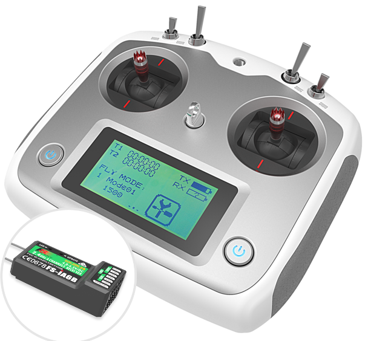
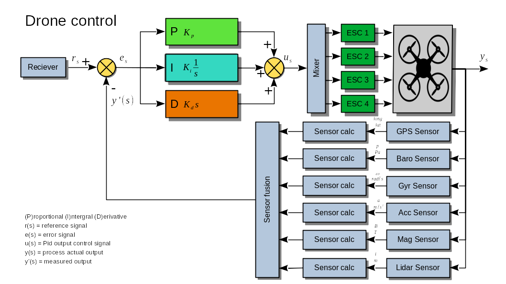
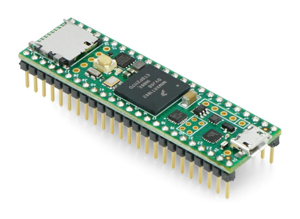

    
 
  

## Main dronecode Teensy4.1 board and Flysky IA6B reciever
- [Drone_IBus_PPM_Gyro_Acc_Baro_GPS_PID_regeling](src/main.cpp)  
  classes:
  - [IBusReceiver](src/IBusReceiver.h)  
  - [GyroSignals](src/GyroSignals.h)  
  - [Barometer](src/Barometer.h)  

## Explore code by seperate subjects
- Read IBUS receiver by decoding PPM and writes values to PWM outputs   
- Read IBUS receiver by decoding IBUS  
- Read GPS sensor GY_GPSV3_NEO_M9N  
- Read GYRO ACCELERATION sensor MPU6050 and use sensor fusion with complementary filtering  
- Read barometer sensor BMP280  

## Flysky sender reciever
> [FlySky website FS-i6S sender](https://www.flysky-cn.com/fsi6s)  
> [Flysky IA6B receiver 6 channels (pwm) 8 channels (ppm) 10 channels (IBus)](https://www.flysky-cn.com/ia6b-canshu)

  

### Flysky reciever IBUS protocol servo and sensor data
> [IBUS explained Betaflight](https://betaflight.com/docs/wiki/guides/current/ibus-telemetry)  
> [IBUS github](https://github.com/bmellink/IBusBM)

## Drone control diagram

## Microcontrollerboard Teensy (4.1)
> [Teensy doc](https://www.pjrc.com/teensy/index.html)  
> [USB power and external power doc](https://www.pjrc.com/teensy/external_power.html)  
> [pins teensy board doc](https://www.pjrc.com/store/teensy41.html#pins)  
> [Pinout referencecard front](https://www.pjrc.com/teensy/card11a_rev4_web.pdf)  
> [Pinout referencecard back](https://www.pjrc.com/teensy/card11b_rev4_web.pdf)  
> [Teensy 4.1 technical doc](https://www.pjrc.com/store/teensy41.html)  

## Sensor fusion accelerometers and gyroscopes
> [Sensor fusion explained](https://www.digikey.nl/nl/articles/apply-sensor-fusion-to-accelerometers-and-gyroscopes)  

## IMU (Inertial Measurement Unit) depth  
> Hrisko, J. (2021). Gyroscope and Accelerometer Calibration with Raspberry Pi. Maker Portal.  
> https://makersportal.com/blog/calibration-of-an-inertial-measurement-unit-imu-with-raspberry-pi-part-ii  
> [Gyro Acc sensor MPU-6050 register mapping](https://invensense.tdk.com/wp-content/uploads/2015/02/MPU-6000-Register-Map1.pdf)  
> [Gyro Acc sensor MPU-6050 datasheet](https://invensense.tdk.com/wp-content/uploads/2015/02/MPU-6000-Datasheet1.pdf)  

## GPS Sensor GNSS data
> [GPS sensor data](https://mediatum.ub.tum.de/doc/1273200/1273200.pdf)  

## drone parts documentation
> [Motor Brushless Emax RSIII 2306 2500kV](https://emaxmodel.com/collections/rsiii-series/products/copy-of-pre-order-emax-rsiii-2207-fpv-racing-motor?variant=43833290424578)  
> [ESC T-motor F45A-32bit 3-6S](https://uav-en.tmotor.com/html/2018/esc_0712/173.html)  
> [Opensource controller software BL_HELI_32bit ](https://oscarliang.com/connect-flash-blheli-32-esc/)  
> [PDB (Power Distribution Board) BEC (Battery Elemenation Circuit) Mateksys FCHUB-12s V1 EOF](https://www.mateksys.com/?portfolio=fchub-12s)  
>- [PDB manual](https://www.mateksys.com/downloads/FCHUB-12S_Manual.pdf)  

> [Propellor HQprop 5"](https://www.hqprop.com/hq-durable-prop-5x5v1s-2cw2ccw-poly-carbonate-p0182.html)  
