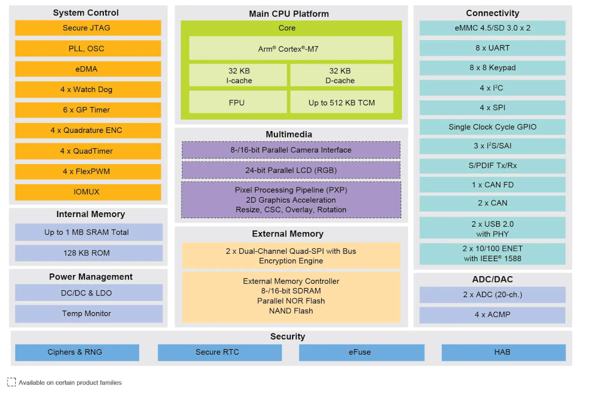

 
   
 
 
## Main code
- Drone Gyro ppm PID   

## Explore code by seperate subjects
- Read IBUS receiver by decoding PPM and writes values to PWM outputs   
- Read IBUS receiver by decoding IBUS  
- Read GPS sensor GY_GPSV3_NEO_M9N  
- Read GYRO ACCELERATION sensor MPU6050 and use sensor fusion with complementary filtering  
- Read barometer sensor BMP280  

## Flysky sender reciever
> https://www.flysky-cn.com/fsi6s  

  

## Microcontrollerboard Teensy (4.1)
> [Teensy doc](https://www.pjrc.com/teensy/index.html)  
> [USB power and external power doc](https://www.pjrc.com/teensy/external_power.html)  
> [pins teensy board doc](https://www.pjrc.com/store/teensy41.html#pins)  
> [Pinout referencecard front](https://www.pjrc.com/teensy/card11a_rev4_web.pdf)  
> [Pinout referencecard back](https://www.pjrc.com/teensy/card11b_rev4_web.pdf)  
> [Teensy 4.1 technical doc](https://www.pjrc.com/store/teensy41.html)  

## IBUS protocol Flysky reciever servo and sensor data
> https://betaflight.com/docs/wiki/guides/current/ibus-telemetry  
> https://github.com/bmellink/IBusBM  

## Sensor fusion accelerometers and gyroscopes
> https://www.digikey.nl/nl/articles/apply-sensor-fusion-to-accelerometers-and-gyroscopes

## IMU depth  
> Hrisko, J. (2021). Gyroscope and Accelerometer Calibration with Raspberry Pi. Maker Portal.  
> https://makersportal.com/blog/calibration-of-an-inertial-measurement-unit-imu-with-raspberry-pi-part-ii  

## GPS Sensor GNSS data
(https://mediatum.ub.tum.de/doc/1273200/1273200.pdf)
